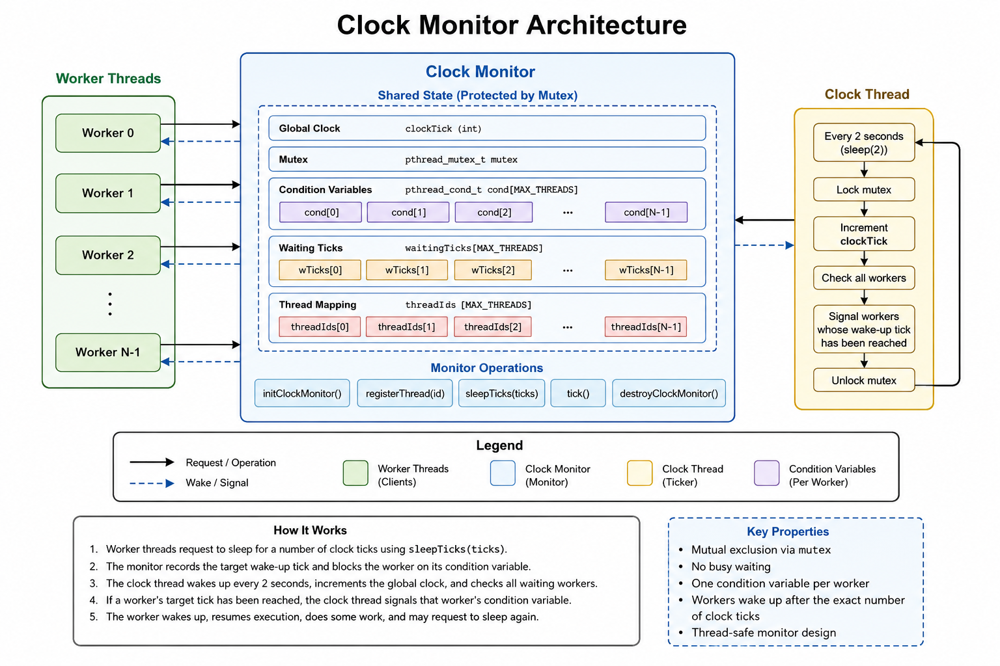

<div align="center">

# Clock Monitor in C

### Thread synchronization using monitors, mutexes, and condition variables

**C • Operating Systems • POSIX Threads • Monitors**

</div>

---

## Overview

This project implements a **Clock Monitor** using **POSIX threads (pthreads)**, mutexes, and condition variables in C.

The monitor simulates a global clock that advances periodically while multiple worker threads request to sleep for a specified number of clock ticks. Each worker is blocked until the requested number of ticks has elapsed, after which it is awakened and continues its execution.

The implementation demonstrates the use of monitor-based synchronization, mutual exclusion, condition variables, and thread coordination without busy waiting.

This project was developed as part of my study of **Operating Systems**, with emphasis on concurrent programming, thread synchronization, monitors, and inter-thread communication.

---

## Features

- Monitor-based synchronization
- POSIX Threads (pthreads)
- Mutex-protected shared data
- One condition variable per worker thread
- Tick-based sleeping mechanism
- Thread-safe monitor implementation
- Error checking for pthread operations
- Modular project organization

---

## Repository Structure

```text
.
├── README.md
├── LICENSE
├── Makefile
│   
├── docs/
│   ├── monitor-design.md
│   └── synchronization-flow.md
│   
├── examples/
│   └── sample-output.txt
│   
└── src/
    ├── main.c
    ├── clock_monitor.c
    └── clock_monitor.h
```

The repository is organized to separate the implementation, documentation, and example output, making the project easy to understand, build, and extend.

---

## Building and Running

### Requirements

- GCC with C11 support
- POSIX Threads (pthreads)
- GNU Make

Compile the project:

```bash
make
```

Run the program:

```bash
make run
```

The program executes continuously until it is terminated manually using **Ctrl+C**.

Clean generated files:

```bash
make clean
```

---

## Example

A sample execution is shown below:

```text
Worker 0: needs to sleep 4 ticks
Worker 1: needs to sleep 8 ticks
Clock tick: 1
Clock tick: 2
Clock tick: 3
Clock tick: 4
Worker 0: woke up after 4 ticks
Worker 0: doing some work before next sleep
```

The program executes continuously to simulate an active clock monitor. Execution can be terminated manually using **Ctrl+C**.

A longer execution log is available in the `examples/sample-output.txt` file.

---

## Architecture

The following diagram illustrates the architecture of the Clock Monitor implementation. It shows how worker threads interact with the monitor to sleep for a specified number of clock ticks, while the clock thread periodically updates the global clock and wakes the appropriate waiting threads.

<p align="center">
    
</p>

---

## Operating Systems Concepts

This project demonstrates the implementation and practical use of several fundamental operating systems concepts, including:

- Monitor-based synchronization
- POSIX thread creation and management
- Mutual exclusion using mutexes
- Thread coordination using condition variables
- Shared-memory synchronization
- Blocking and waking threads without busy waiting
- Thread-safe access to shared data
- Concurrent programming in C

---

## Implementation Details

The monitor maintains a global clock (`clockTick`) together with a mutex protecting all shared state.

Each worker thread registers itself with the monitor, requests to sleep for a specific number of clock ticks, and blocks on its own condition variable until the requested wake-up time is reached.

A dedicated clock thread periodically increments the global clock and checks all waiting threads. Whenever a worker's wake-up tick has been reached, the corresponding condition variable is signaled, allowing the worker to resume execution.

The implementation avoids busy waiting by relying entirely on mutexes and condition variables for synchronization.

---

## Educational Objectives

This project demonstrates:

- Designing monitor-based synchronization mechanisms
- Coordinating multiple concurrent threads
- Using mutexes to protect shared resources
- Using condition variables for thread synchronization
- Implementing blocking synchronization without busy waiting
- Developing modular concurrent software in C

---

## Future Improvements

Potential future extensions include:

- Dynamic creation and removal of worker threads
- Configurable clock interval
- Support for multiple independent clock monitors
- Thread priority scheduling
- Performance statistics and monitoring
- Graceful program termination

---

## License

This project is licensed under the **MIT License**.

---

<div align="center">

**Developed by Anastasis Zachariou**

</div>
