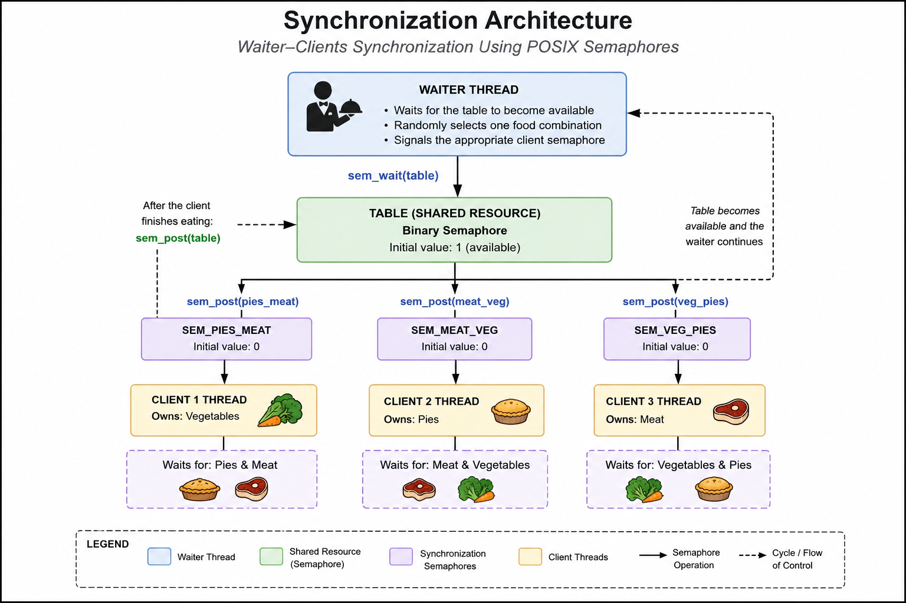

<div align="center">

# Synchronization Using POSIX Semaphores

### Waiter–Clients synchronization problem implemented with POSIX threads and semaphores

**C • Operating Systems • POSIX Threads • Semaphores**

</div>

---

## Overview

This project demonstrates thread synchronization using **POSIX threads** and **POSIX semaphores** in C.

A waiter thread repeatedly places one of three possible food combinations on a shared table, while three client threads wait for the combination that complements the food item they already possess.

Semaphores coordinate the interaction so that only the appropriate client proceeds to consume the meal. After the client finishes eating, the table becomes available for the next round.

The implementation provides a clear example of synchronization using shared resources, signaling, and coordination between concurrent threads without busy waiting.

---

## Features

- Thread synchronization using POSIX semaphores
- Concurrent execution with POSIX threads
- Shared table coordination between a waiter and multiple clients
- Mutual exclusion through semaphore-based synchronization
- Randomized food selection by the waiter
- Error handling for semaphore and thread operations
- Clean implementation that compiles with `-Wall -Wextra -Werror`
- Demonstrates synchronization without busy waiting

---

## Repository Structure

```
synchronization/
│
├── docs/
│   ├── synchronization-design.md
│   └── semaphore-workflow.md
│ 
├── examples/
│   └── sample-output.txt
│ 
├── LICENSE
├── Makefile
├── README.md
└── restaurant_sync.c
```

---

## Building and Running

Clone the repository:

```bash
git clone https://github.com/azachariou24/operating-systems-c.git
```

Navigate to the project directory:

```bash
cd operating-systems-c/src/synchronization
```

Compile the project:

```bash
make
```

Run the executable:

```bash
./restaurant_sync
```

Clean the build files:

```bash
make clean
```

---

## Example

Example program output:

```text
Waiter gives meat & veg
Client2 has pies, starts eating

Waiter gives veg & pies
Client3 has meat, starts eating

Waiter gives pies & meat
Client1 has veg, starts eating
```

A complete execution sample is available in:

```text
examples/sample-output.txt
```

---

## Architecture

<p align="center">
    
</p>

The application consists of four concurrent threads:

- One **waiter thread** responsible for placing two food items on the shared table.
- Three **client threads**, each permanently owning one food item and waiting for the remaining two.

A binary semaphore represents the availability of the shared table, ensuring that only one food combination is present at any time.

Three additional semaphores are used to notify the appropriate client when the required food combination becomes available.

This synchronization strategy guarantees that exactly one client proceeds after each waiter action while preventing concurrent access to the shared table.

---

## Operating Systems Concepts

This project demonstrates several fundamental operating systems concepts, including:

- **Thread synchronization** using POSIX semaphores
- **Concurrent execution** with POSIX threads
- **Mutual exclusion** through controlled access to a shared resource
- **Semaphore-based signaling** between cooperating threads
- **Resource coordination** without busy waiting
- **Producer–consumer style interaction** between the waiter and clients
- **Thread-safe synchronization** using POSIX synchronization primitives

---

## Implementation Details

The synchronization mechanism is implemented using four POSIX semaphores:

- One binary semaphore controls access to the shared table.
- Three synchronization semaphores notify the appropriate client when the required food combination is available.

The waiter thread randomly selects one of three possible food combinations and signals the corresponding client. After consuming the meal, the client releases the table, allowing the waiter to continue with the next iteration.

The implementation includes error checking for all semaphore and thread operations and follows a clean, modular coding style that compiles without warnings using `-Wall -Wextra -Werror`.

---

## Educational Objectives

This project was developed to demonstrate practical synchronization techniques in concurrent programming using POSIX threads and semaphores.

Its primary educational goals are to:

- Understand semaphore-based thread synchronization
- Coordinate multiple concurrent threads safely
- Manage shared resources without busy waiting
- Apply POSIX thread and semaphore APIs correctly
- Develop clean and maintainable concurrent C programs

---

## Future Improvements

Possible extensions of this project include:

- Graceful program termination using signal handling
- Configurable execution parameters through command-line arguments
- Logging with timestamps for synchronization analysis
- Additional synchronization scenarios using POSIX semaphores
- Performance evaluation under different scheduling conditions

---

## License

This project is licensed under the **MIT License**.

---

<div align="center">

**Developed by Anastasis Zachariou**

</div>