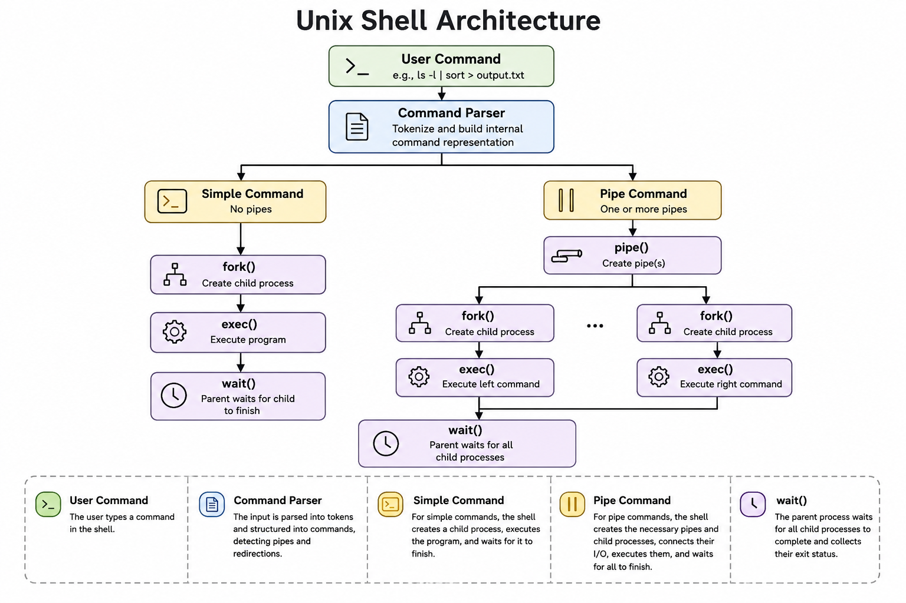

<div align="center">

# Unix Shell in C

### A lightweight Unix shell supporting command execution, pipes, and I/O redirection

**C • Unix • Operating Systems • Systems Programming**

</div>

---

## Overview

This project implements a lightweight Unix shell in C that supports command execution, input/output redirection, and Unix pipes.

The shell demonstrates fundamental operating systems concepts including process creation, program execution, file descriptor manipulation, and inter-process communication through pipelines.

The project was developed as part of my study of **Operating Systems**, with emphasis on Unix systems programming, process management, and practical understanding of core operating system mechanisms.

---

## Features

- Execution of external commands
- Input redirection (`<`)
- Output redirection (`>`)
- Unix pipe (`|`) support
- Lightweight command parser
- Demonstration script with sample commands
- Clean and modular implementation

---

## Repository Structure

```text
src/
└── tiny-shell/
    ├── tsh.c
    ├── README.md
    └── examples/
        └── sample_commands.sh
```

---

## Building and Running

Compile

```bash
gcc tsh.c -o tsh
```

Run interactively

```bash
./tsh
```

Execute the demonstration script

```bash
./tsh < examples/sample_commands.sh
```

---

## Example

The following commands demonstrate the supported shell functionality:

```bash
./tsh < examples/sample_commands.sh
```

Example session:

```text
ls > output.txt
cat < output.txt
ls | sort | uniq | wc
cat < output.txt | sort | uniq | wc > result.txt
```

---

## Architecture

The following diagram illustrates the overall execution flow of the shell, from command parsing to process creation, execution, and synchronization.

<p align="center">
    
</p>

---

## Operating Systems Concepts

This project demonstrates the implementation and practical use of several fundamental operating systems concepts, including:

- Process creation using `fork()`
- Program execution using the `exec()` family
- Parent-child process relationships
- Input/output redirection through file descriptors
- Inter-process communication using Unix pipes
- Process synchronization using `wait()`
- Command parsing and execution
- Unix process lifecycle

---

## Implementation Details

The shell is built around a command parser that constructs internal command representations before execution.

The implementation supports:

- Execution of external programs through Unix process creation
- Input and output redirection using file descriptors
- Multi-stage command pipelines through anonymous pipes
- Recursive execution of parsed command structures
- Parent-child process synchronization using `wait()`
- Error handling for failed system calls

---

## Educational Objectives

This project demonstrates:

- Unix systems programming in C
- Process creation and management
- Program execution using the `exec()` family
- Input/output redirection and file descriptor manipulation
- Inter-process communication using Unix pipes
- Process synchronization
- Command parsing and execution
- Practical understanding of core operating system mechanisms

---

## Future Improvements

Potential future extensions include:

- Support for background process execution (`&`)
- Built-in shell commands (e.g., `cd`, `pwd`, `exit`)
- PATH environment variable support
- Environment variable expansion
- Command history
- Signal handling (e.g., `Ctrl+C`, `Ctrl+Z`)

---

## License

This project is licensed under the **MIT License**.

---

<div align="center">

**Developed by Anastasis Zachariou**

</div>
